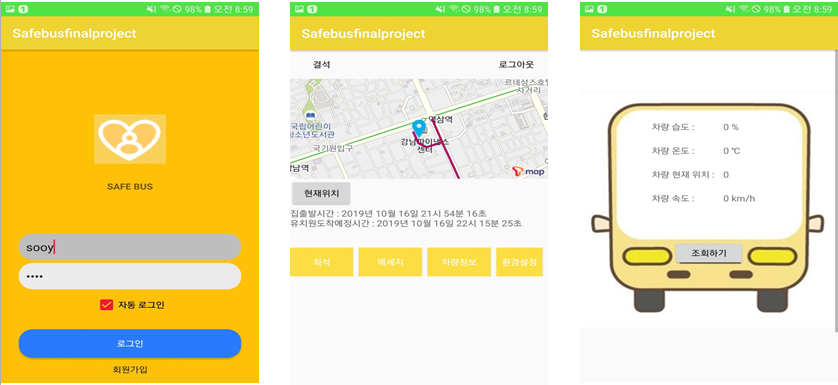

# SafeBus (2019/8/30 ~ 2019/10/17)

## CAN 통신을 활용한 어린이차량 통합 관제 시스템

개요 : 2012년 우리나라 보건복지부에서 안전강화 조치 발표(운전자나 인솔교사가 어린이가 내리는 시간을 기록)를 하였으나 여전히 사고는 발생하고 있고, 앞으로 안전강화 조치와 법이 강화될 전망이다. 그에 따라 최신 IT 기술이 적용된 통합 안전 관제 시스템을 개발해 학부모가 믿고 맡길 수 있는 안전한 환경을 만들고자 한다.

 

### 최종 개발 모습

- App

  

 

-----------------------------------------------------------------------------------------------------------------------------------------------------------

### 시스템 구조

 

-----------------------------------------------------------------------------------------------------------------------------------------------------------

### 데이터베이스 구조

 

-----------------------------------------------------------------------------------------------------------------------------------------------------------

### ROLE

1. 발표자

2. 앱 내 Map View 구현

   - Tmap API 연동
   - 경로 최적화에 따른 유치원 또는 집 도착 시간 안내 구현

3. CAN 통신 구현

   - Latte Panda를 Connected Car로 가정

   - CAN-Pro  간 통신(Serial 통신)

 

-----------------------------------------------------------------------------------------------------------------------------------------------------------

### 구현 소스

- Android
  - MapViewActivity
  - RequestHttpURLConnection
  - RouteOptimization
  - RouteOptimizationVia

 

- Server
  - ConnectDB3.java : 어린이의 등원/하원을 구분해서 출발지와 목적지까지 각 정류장의 정보를 가져옴
  - ConnectDB4.java : 어린이 차량번호로 해당 차량의 위치정보(위도, 경도) 가져옴
  - routeInfo.jsp : Client로부터 등원/하원인지 알 수 있는 상태정보를 받아 ConnectDB3를 통해 각 정류장의 정보를 return
  - nowLocInfo.jsp : Client로부터 차량번호를 받아 ConnectDB4를 통해 해당 차량의 위치정보를 return

 

- CAN 통신

  - 두 LattePanda는 Serial 통신을 한다

  - CarLattePanda.java : Connected Car 역할을 하며, RFID를 인식하고 server에게 실시간 차량정보를 server역할을 하는 Latte Panda에 전송한다(serial)
  - ServerLattePanda.java : Connected Car 역할을 하는 LattePanda로부터 실시간 차량정보를 전송받는다.(DB저장까지 포함된 소스는 ConnectTCP3 <= TCP 통신은 다른 조원이 담당)